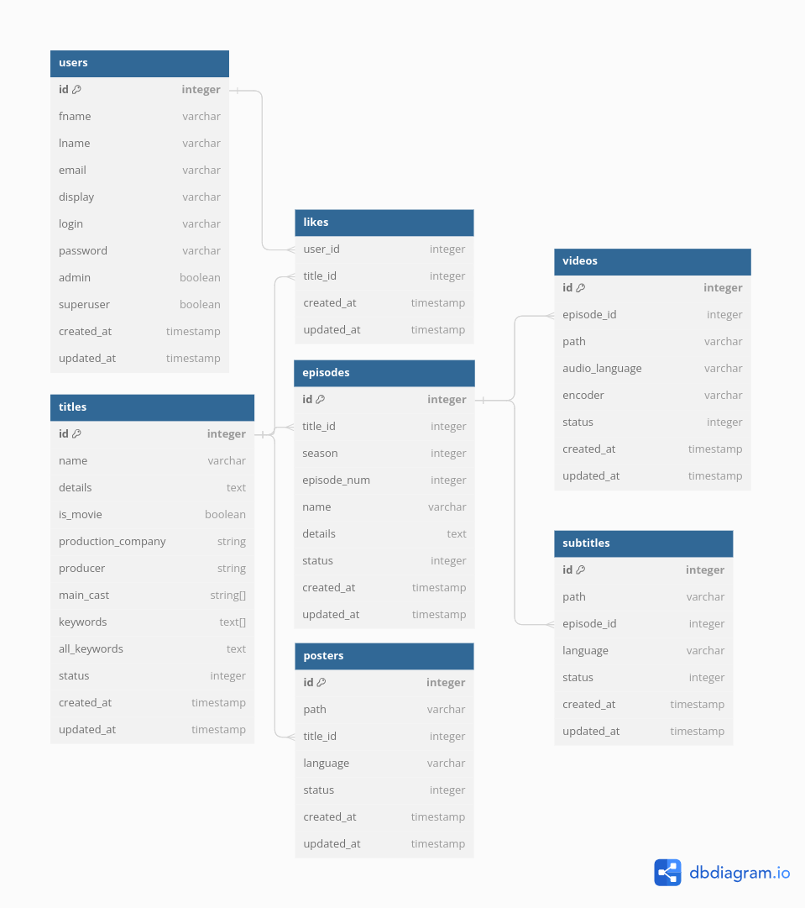

Welcome to novarift repository

This is an app that wants to copy Netflix :D

# Project Explaination

## Postgres Database Structure

[DB Diagram Link](https://dbdiagram.io/d/657dbd8a56d8064ca026714e)

## Environment variables
 - DB_CONNECTION : Database type, the default one is postgres (pg)
 - PG_HOST : Database hostname
 - PG_PORT : Database port
 - PG_USER : Database user
 - PG_PASSWORD : Database password
 - PG_DB_NAME : Database name

 - IMAGE_HOSTNAME : Hostname from which accept serving images without a need for authentication (usefull if you have a next image optimization)